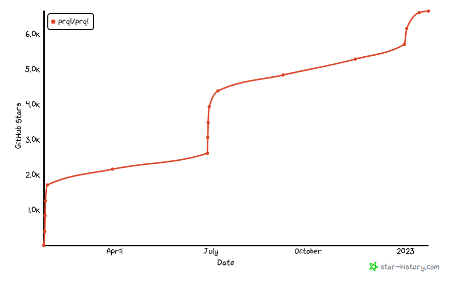
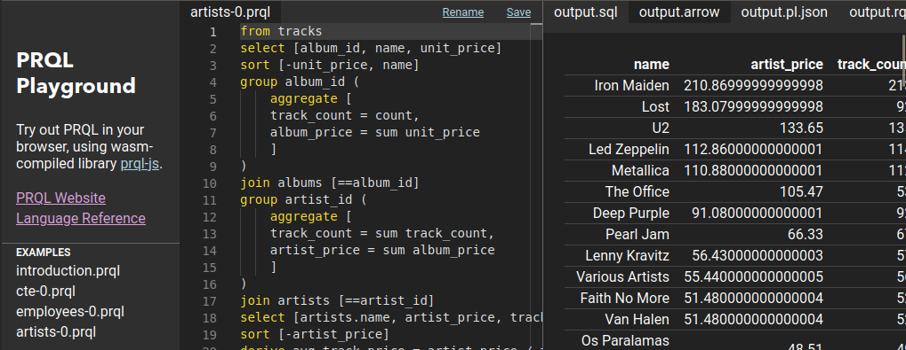
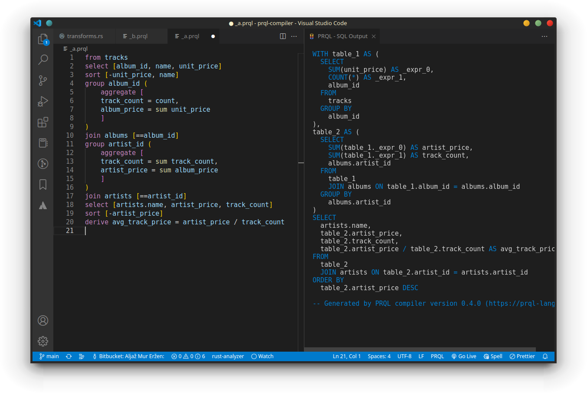
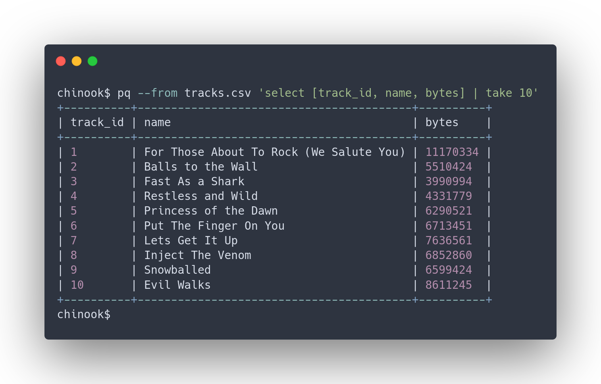
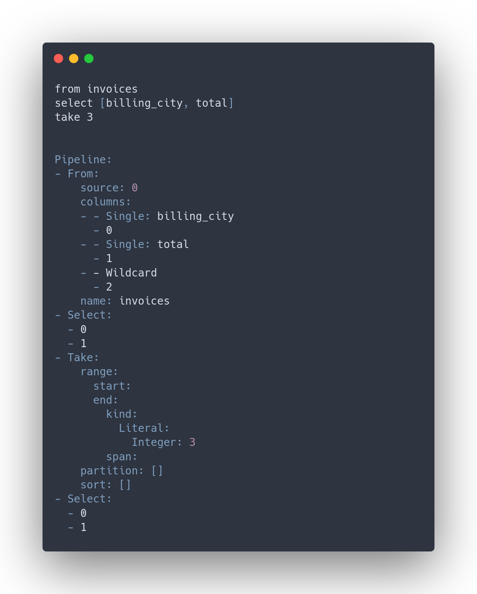

A year ago, we posted
[a proposal for a modern SQL replacement](https://news.ycombinator.com/item?id=30060784)
to Hacker News. It immediately sparked the interest of many people dealing with
data. The project grew a community of people who are now developing the
language, tooling, and the idea of a modern relational language. Since then
we've opened 1577 issues & PRs on [our main repo](https://github.com/PRQL/prql),
submitted 4211 comments, and made 1176 commits.

The number of stars is skyrocketing every time the project appears on Hacker
News, which we believe to be an indicator that people are eager to adopt the
language if the tooling is made accessible enough.



## Where are we?

Language design & development in the last year have been focused on these areas:

- design of basic
  [transforms](https://prql-lang.org/book/reference/stdlib/transforms/) and
  their [interactions](https://github.com/PRQL/prql/issues/300),

- fundamentals of how [functions](https://github.com/PRQL/prql/issues/444) and
  pipelines are [evaluated](#define-functional-semantics).

- small quality-of-life language features (e.g. syntax for [f-strings, dates,
  coalesce operator](https://prql-lang.org/book/reference/syntax/
  [case](https://github.com/PRQL/prql/issues/504)),

PRQL is now in a state where it can greatly improve the developer experience for
writing complex analytical queries, but it does require a bit of fiddling to set
up in your environment.

In the coming year, we are aiming to improve that by providing a dbt plugin and
integrations for tools like Rill-developer, Metabase, and DataGrip. Read more
about our plans and ambitions in [the roadmap](https://prql-lang.org/roadmap/).

## How are people using it?

For data analytics at [SuperSimple](https://gosupersimple.com/):

> We've been using PRQL under the hood to power complex analytics workflows at
> Supersimple for more than 6 months now. The speed of iteration and response to
> user feedback has been amazing during this period!
>
> PRQL is what I think SQL should have been like from day 1 and adopting it has
> likely literally saved us months.

For making
[pretty reports with SQLite](https://prql-lang.org/posts/2023-01-28-format-pretty-reports/).

For quick, readable
[scripts in the command line](https://prql-lang.org/posts/2023-01-27-prql-query/).

## What have you missed?

In the past year, the community has created many things, some of which have not
been noticed as much as they should have been. In the summary of the year, we
want to fix that and put a spotlight on the amazing work that was done.

### Playground

We have a [Playground](https://prql-lang.org/playground/) that can compile and
execute PRQL queries in-browser. It's using prqlc and DuckDB, both compiled to
WASM modules.



Currently, this is the best way to see how the relation is manipulated instantly
as you type the query.

### VS Code extension

Extension that provides syntax highlighting and compiled SQL within your editor.



### prql-query

CLI tool that uses DuckDB and DataFusion to execute PRQL queries from your
terminal. Useful for wrangling your CSV and parquet files on the go.



### Define functional semantics

Given the initial proposal of the language, we constructed consistent semantics
of how functions in PRQL work, what they can express and how can they be abused.

To keep this post brief, we'll expose a single snippet of what's possible and
invite you to read more in
[a recent post](https://prql-lang.org/functional-relations/).

```prql
let take_oldest = n rel -> (
    rel
    sort [-invoice_date]
    take n
)

from.invoices
take_oldest 3
```

> Function `take_oldest` is used in the main pipeline, just any other regular
> transform.

### Relational Query

The design of prqlc strives to have a complexity bottleneck with an intermediate
representation named
[Relation Query](https://docs.rs/prqlc/latest/prqlc/ast/rq/index.html) or RQ for
short. Think of it as equivalent to a [Substrait plan](https://substrait.io/).

Its goal is the ability to express any operation possible in SQL while
containing as few constructs as possible. This makes it easy to implement
backends that compile RQ to SQL or any other language or library dealing with
relations or dataframes.



> Note how prqlc inferred the structure of the table we are selecting from. It
> knows that it must contain columns `billing_city` and `total`, but also notes
> that there may be many other columns.
