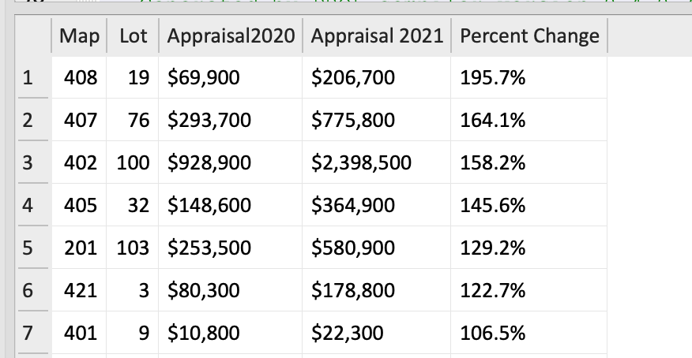

# Format Pretty Reports with PRQL

> I can no longer bring myself to write bare SQL - PRQL makes building queries so easy.

Here's how I use PRQL _functions_, _aliases_ for naming variables,
and multiple `select` statements to "pretty up" a SQL report.

From my database of property values,
I want to show the change across years,
displaying their values along with their percent change.

1. **Functions:** Of course, property values are in dollars. So I could simply display them as `450000`. But they are more compelling if they're written as `$450,000`. Writing the SQL code and format strings for each column would be boring (and error-prone). PRQL allows me to create a `dollars` function and then use it multiple times:

   ```prql
   # dollars displays a numeric value as whole dollars with commas
   func dollars d -> s"""printf("$%,d",{d})"""
   ...
   (dollars App_Total2020),
   (dollars App_Total2021),
   ...
   ```

   I also want to compute the percent change between values. It's easy to create a `pct` function:

   ```prql
   # pct computes the amount (percent) the new differs from old
   func pct o n -> 100.0*( n - o ) / o
   ```
   One final function: the `pct` function returns a floating point number with many digits after the decimal place. I only want to display one place in my results, with a trailing `%`. So I wrote a `prtpct` ("print percent") function that uses a `printf()` to format the value.
   
   ```prql
   # prtpct prints a floating point number with "%"
   func prtpct v -> s'printf("%1.1f%", {v})'
   ```
   
2. **Column Headings:** Use a PRQL _alias_ to assign each column a nice name. This becomes its column heading. The examples above might be:

   ```prql
    Appraisal2020 = (dollars App_Total2020), 
	`Appraisal 2021` = (dollars App_Total2021),
   ```

   Note how the second example puts the column heading in backticks to preserve spaces.
	
3. **Excluding certain columns:** I want to sort results by the (numeric) percent change, but I don't want to display that percentage value (with multiple decimal places) in the final table. So I split the query into pieces: the first `select` collects all the columns necessary (including using `pct` to calculate the percentage as a number).
The query then sorts the values and
passes those results to a second `select` that's responsible
for formatting the column headings and contents (using aliases and `prtpct`).

4. **Putting it all together:** Here is my workflow for a typical query. 

   * Using the tools listed below... [^1]
   * Enter the PRQL query in the VSCode editor. Use a `.prql` suffix for the file. 
   * Open the PRQL VSCode extension (Ctl-Shift-P, or Cmd-Shift-P on Mac).
   It'll appear and display the compiled SQL in a second pane on the right.
   * Copy the SQL from the right pane and paste it into the DBM program. Run the query. That's it!

Here's the PRQL for this example, followed by the result from my database.
_Note:_ Paste the PRQL query below into the
[Playground](https://prql-lang.org/playground/)
to see what the PRQL compiler produces.

   ```prql
   # dollars displays a numeric value as dollars with commas
   func dollars d -> s"""printf("$%,d",{d})"""

   # pct computes the amount (percent) the new differs from old
   func pct o n -> 100.0*( n - o ) / o
   
   # prtpct prints a floating point number with "%"
   func prtpct v -> s'printf("%1.1f%", {v})'

   # Step 1: First calculate important columns
   from PropertyData
   select [
     Map, Lot,
     App_Tot2020,    	   
     App_Tot2021,
     pctchange = (pct App_Total2020 App_Total2021),
   ]
   
   # Step 2: Sort the resulting table by pctchange
   sort [-pctchange]
   
   # Step 3: Format the column headings and contents
   select [
      Map, Lot,
      Appraisal2020 = (dollars App_Total2020),       
     `Appraisal 2021` = (dollars App_Total2021),
     `Percent Change` = (prtpct pctchange),
   ]
   take 20
   ```

The image below shows the result of that query. Note that:

* The column headings match the _aliases_ of the second `select` statement
* The `dollars` function formats values with `$` and `,` as expected
* The `pct` function computes the percent change between the _old_ and _new_ values
* The `prtpct` function formats the value with a single decimal place and appends a `%`



[^1]: **My Tools:** I use [VSCode](https://code.visualstudio.com/) to maintain a folder of PRQL queries for re-use. I use the [VSCode Extension](https://marketplace.visualstudio.com/items?itemName=PRQL-lang.prql-vscode) to compile PRQL into SQL. My data is in a SQLite database, and I use [DB Browser for SQLite](https://sqlitebrowser.org/) to run queries.
