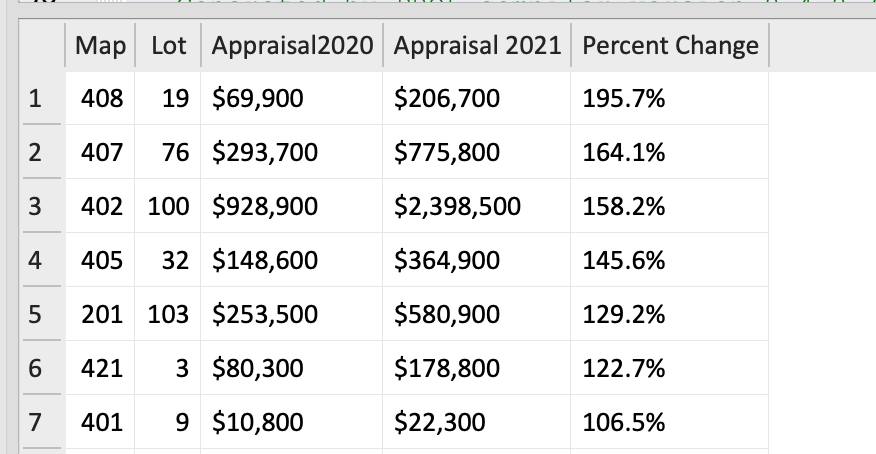

> I can no longer bring myself to write bare SQL - PRQL makes building queries
> so easy.

Here's how I use PRQL _functions_, _aliases_ for naming variables, and multiple
`select` statements to "pretty up" a SQL report.

From my database of property values, I want to show the change across years,
displaying their values along with their percent change.

1. **Functions:** Of course, property values are in dollars. So I could simply
   display them as `450000`. But they are more compelling if they're written as
   `$450,000`. Writing the SQL code and format strings for each column would be
   boring (and error-prone). PRQL allows me to create a `dollars` function and
   then use it multiple times:

   ```prql
   # dollars displays a numeric value as whole dollars with commas
   func dollars d -> s"""printf("$%,d",{d})"""
   ...
   (dollars App_Total2020),
   (dollars App_Total2021),
   ...
   ```

   I also want to compute the percent change between values. It's easy to create
   a `percent_diff` function:

   ```prql
   # percent_diff computes the amount (percent) the new differs from old
   func percent_diff old new -> 100.0*( new - old ) / old
   ```

   One final function: the `percent_diff` function returns a floating point
   number with many digits after the decimal place. I only want to display one
   place in my results, with a trailing `%`. So I wrote a `format_percent`
   function that uses a `printf()` to format the value.

   ```prql
   # format_percent prints a floating point number with "%"
   func format_percent v -> s'printf("%1.1f%", {v})'
   ```

2. **Column Headings:** Use a PRQL _alias_ to assign each column a nice name.
   This becomes its column heading. The examples above might be:

   ```prql
    Appraisal2020 = (dollars App_Total2020),
   `Appraisal 2021` = (dollars App_Total2021),
   ```

   Note how the second example puts the column heading in backticks to preserve
   spaces.

3. **Excluding certain columns:** I want to sort results by the (numeric)
   percent change, but I don't want to display that percentage value (with
   multiple decimal places) in the final table. So I split the query into
   pieces: the first `select` collects all the necessary columns (adding a new
   column using `percent_diff`). The query then sorts the values and passes
   those results to a second `select` that's responsible for formatting the
   column headings and contents (using aliases and `format_percent`).

4. **Putting it all together:** Here is my workflow for a typical query.

   - Using the tools listed below... [^1]
   - Enter the PRQL query in the VSCode editor. Use a `.prql` suffix for the
     file.
   - Open the PRQL VSCode extension (Ctl-Shift-P, or Cmd-Shift-P on Mac). It'll
     appear and display the compiled SQL in a second pane on the right.
   - Copy the SQL from the right pane and paste it into the DBM program. Run the
     query. That's it!

Here's the PRQL for this example, followed by the result from my database.
_Note:_ Paste the PRQL query below into the
[Playground](https://prql-lang.org/playground/) to see what the PRQL compiler
produces.

```prql
# dollars displays a numeric value as dollars with commas
func dollars d -> s"""printf("$%,d",{d})"""

# percent_diff computes the amount (percent) the new differs from old
func percent_diff old new -> 100.0*( new - old ) / old

# format_percent prints a floating point number with "%"
func format_percent v -> s'printf("%1.1f%", {v})'

# Step 1: First calculate important columns
from PropertyData
select [
  Map, Lot,
  App_Total2020,
  App_Total2021,
  pctchange = (percent_diff App_Total2020 App_Total2021),
]

# Step 2: Sort the resulting table by pctchange
sort [-pctchange]

# Step 3: Format the column headings and contents
select [
   Map, Lot,
   Appraisal2020 = (dollars App_Total2020),
  `Appraisal 2021` = (dollars App_Total2021),
  `Percent Change` = (format_percent pctchange),
]
take 20
```

The image below shows the result of that query. Note that:

- The column headings match the _aliases_ of the second `select` statement
- The `dollars` function formats values with `$` and `,` as expected
- The `percent_diff` function computes the percent change between the _old_ and
  _new_ values
- The `format_percent` function formats the value with a single decimal place
  and appends a `%`



[^1]:
    **My Tools:** I use [VSCode](https://code.visualstudio.com/) to maintain a
    folder of PRQL queries for re-use. I use the
    [VSCode Extension](https://marketplace.visualstudio.com/items?itemName=PRQL-lang.prql-vscode)
    to compile PRQL into SQL. My data is in a SQLite database, and I use
    [DB Browser for SQLite](https://sqlitebrowser.org/) to run queries.
